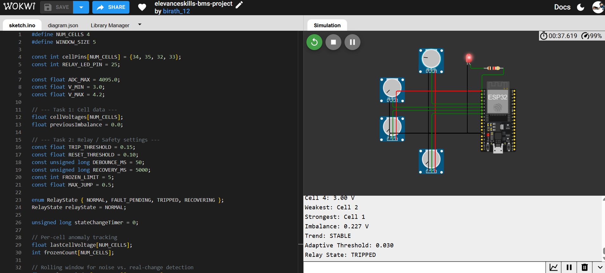
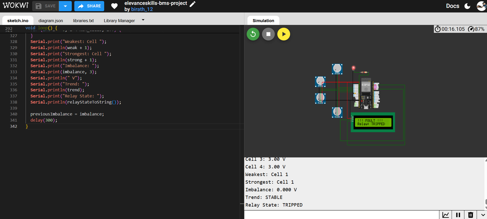
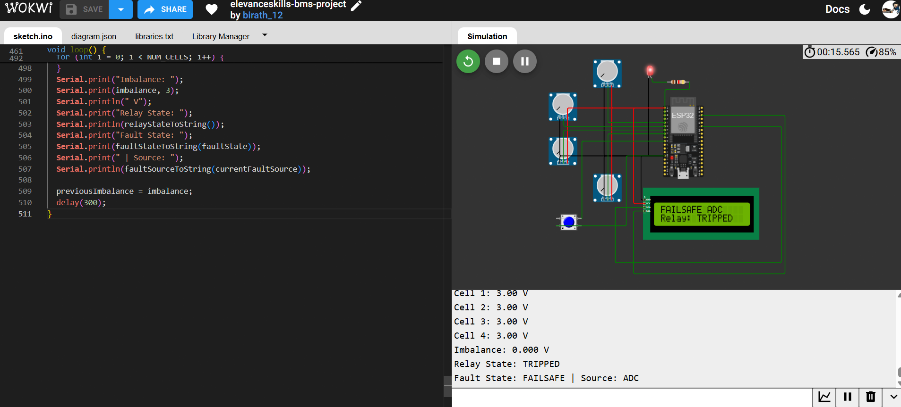
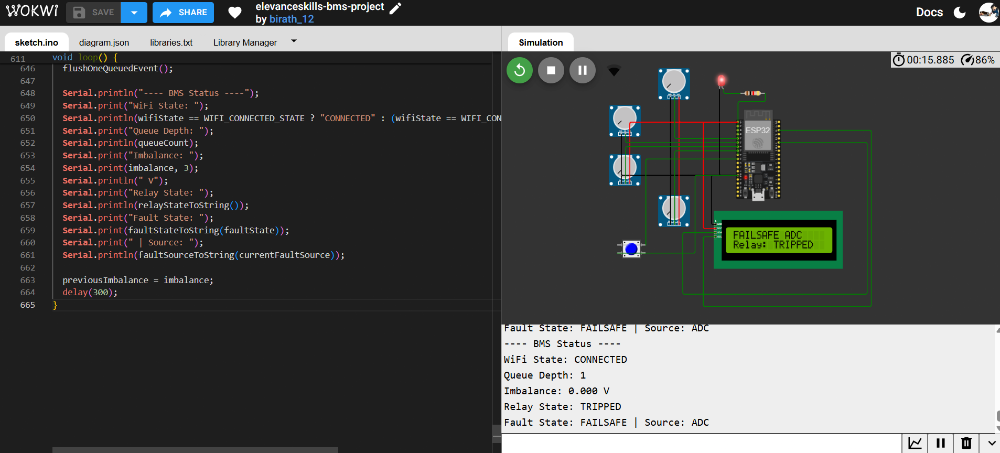
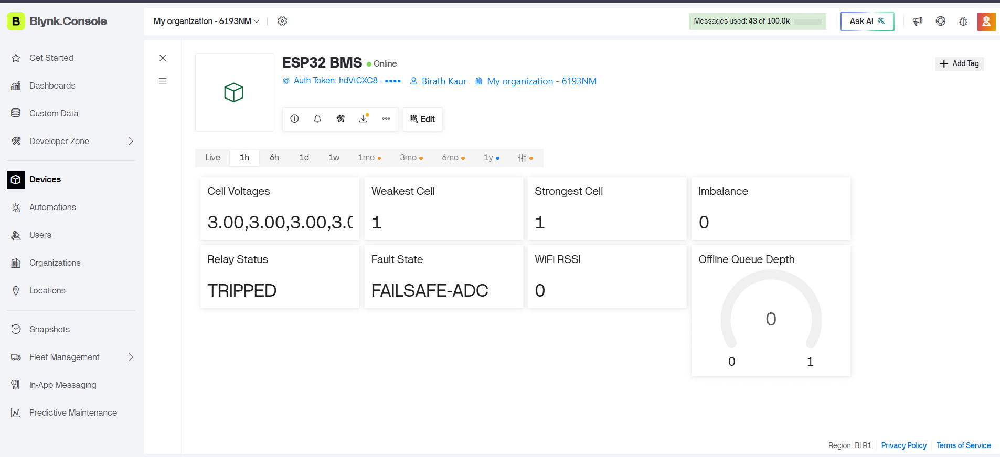
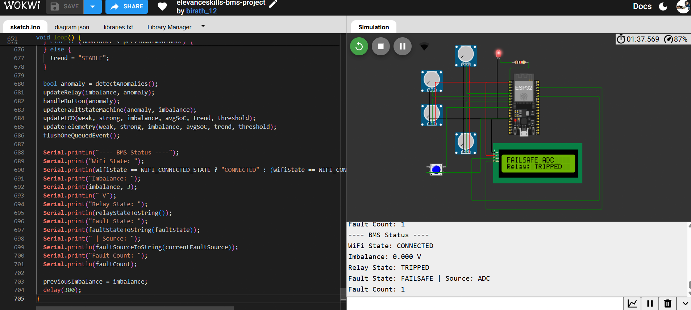
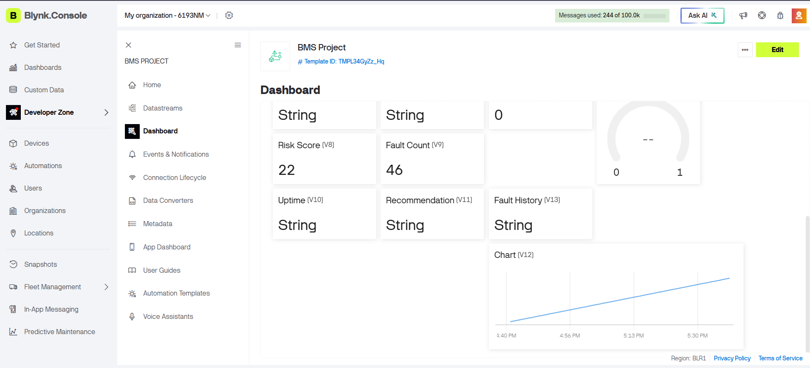

# Elevanceskills Internship — Project Report
**Modular Battery Management, Protection, and Telemetry System**

**Name:** Birath Kaur Ambhore  
**Internship:** Elevanceskills Embedded Systems Internship  
**Platform:** ESP32 (simulated in Wokwi)

---

## Table of Contents
1. [Task 1: Modular Battery Management Engine](#task-1-modular-battery-management-engine) — ✅ Completed
2. [Task 2: Non-Blocking Protection Relay and Safety System](#task-2-non-blocking-protection-relay-and-safety-system) — ✅ Completed
3. [Task 3: Flicker-Free LCD Display Engine](#task-3-flicker-free-lcd-display-engine) — ✅ Completed
4. [Task 4: Fault State Machine with Structured Recovery](#task-4-fault-state-machine-with-structured-recovery) — ✅ Completed
5. [Task 5: Event-Driven Telemetry and Live Blynk Dashboard](#task-5-event-driven-telemetry-and-live-blynk-dashboard) — ✅ Completed
6. [Task 6: Enterprise Blynk Analytics and Decision Dashboard](#task-6-enterprise-blynk-analytics-and-decision-dashboard) — ✅ Completed
---

## Task 1: Modular Battery Management Engine

### Objective
Design a modular BMS engine operating on a scalable array of battery cells,
where the number of cells is controlled by a single compile-time constant.
The engine identifies the weakest and strongest cells, calculates voltage
imbalance, tracks whether imbalance is increasing or decreasing, and applies
adaptive thresholds based on estimated State of Charge (SoC) rather than
fixed limits.

### Design Overview
- Cell count controlled via `#define NUM_CELLS 4`
- Cell voltages simulated using potentiometers wired to ESP32 ADC pins
  (GPIO34, 35, 32, 33), mapped from raw ADC readings (0–4095) to a
  realistic Li-ion voltage range (3.0V–4.2V)
- Core functions: `readCellVoltage()`, `updateAllCells()`,
  `findWeakestCell()`, `findStrongestCell()`, `calculateImbalance()`,
  `estimateSoC()`, `getAdaptiveThreshold()`
- Adaptive threshold logic: stricter thresholds at low SoC, relaxed
  thresholds at high SoC, reflecting that small imbalances matter more
  when a pack is nearly empty

### Verification
Tested in Wokwi by varying potentiometer positions to simulate charging/
discharging cells. Confirmed via Serial Monitor output that:
- Weakest/strongest cell identification updates correctly as voltages change
- Imbalance calculation matches expected voltage differences
- Trend correctly reports INCREASING, DECREASING, or STABLE between readings
- Adaptive threshold shifted from 0.030V to 0.050V as average SoC increased
- Warning correctly triggers whenever imbalance exceeds the current threshold

### Scalability Analysis (4 → 16 cells)
**Memory:** All cell data is stored in arrays sized by `NUM_CELLS`. Each
array element is a 4-byte float, so even at 16 cells, total memory usage
is under 100 bytes — negligible against the ESP32's 520KB RAM.

**Execution time:** Core analysis functions (`findWeakestCell`,
`findStrongestCell`, `calculateImbalance`) all iterate once through the
cell array — O(n) time complexity. At 16 cells, this remains a
microsecond-scale operation on a 240MHz processor, with no meaningful
performance impact.

**Data structures:** Because the design uses arrays indexed by a single
`NUM_CELLS` constant (rather than individually named variables per cell),
scaling from 4 to 16 cells requires only two changes: updating the
`NUM_CELLS` value and extending the `cellPins[]` array with the additional
ADC pins. No changes to core logic are needed — this directly fulfills
the "modular, reusable interface" requirement, and mirrors how real
production BMS ICs (e.g., TI BQ76952) handle configurable cell counts.

---

## Task 2: Non-Blocking Protection Relay and Safety System

### Objective
Develop a fully non-blocking safety system that protects the battery pack
by tripping a relay when dangerous conditions are detected, while avoiding
false trips from noise, and following a controlled, timed recovery process.

### Design Overview
- **Non-blocking timing:** Uses `millis()` throughout instead of `delay()`,
  so the relay state machine keeps running and checking conditions on
  every loop iteration without ever freezing the program.
- **Hysteresis:** Two separate thresholds prevent chattering — the relay
  trips when imbalance exceeds `0.15V`, but only resets once imbalance
  drops below `0.10V`. This gap prevents rapid on/off switching when
  imbalance hovers near a single value.
- **Debounce:** A detected fault must persist for at least `50ms`
  (`DEBOUNCE_MS`) before the relay actually trips, filtering out
  momentary electrical noise from being mistaken for a real fault.
- **Sensor anomaly detection:** Each cell's readings are checked every
  loop for:
  - *Frozen readings* — identical value repeated more than 5 times in a row
  - *Unrealistic jumps* — voltage change greater than 0.5V between two
    consecutive readings (physically impossible for a real cell)
  - *Out-of-range values* — voltage outside the valid 2.5V–4.3V window
- **Relay state machine:** Implemented with an enum
  (`NORMAL → FAULT_PENDING → TRIPPED → RECOVERING → NORMAL`), where every
  transition is logged with a clear before/after state description.
- **Timed recovery:** After a fault clears, the system does not
  immediately return to NORMAL. It enters a `RECOVERING` state and must
  observe 5 continuous seconds (`RECOVERY_MS`) of clean, in-threshold
  readings before fully resuming normal operation. Any fault recurrence
  during this window sends it back to `TRIPPED`.
- **Relay output:** Simulated using an LED wired to GPIO25 — LED ON
  represents the relay tripped (power cut), LED OFF represents normal
  operation.

### Verification
Tested in Wokwi by rapidly adjusting potentiometers to create imbalance
above the trip threshold. Confirmed via Serial Monitor that:
- The system correctly transitions through
  `NORMAL → FAULT_PENDING → TRIPPED` when imbalance persists past the
  debounce window
- The LED turns on exactly when the relay state reaches `TRIPPED`
- Reducing imbalance below the reset threshold moves the system into
  `RECOVERING`, and it only returns to `NORMAL` (LED off) after the full
  5-second timed recovery period with no repeated faults
- All state transitions are printed with clear before/after labels,
  satisfying the structured logging requirement
- The system remained stable under repeated, rapid fault triggering
  without missing transitions or requiring a reset
  

## Task 3: Flicker-Free LCD Display Engine
### Objective
Create an LCD rendering engine that updates only the screen positions
whose values have changed, avoiding full-screen clears and visible
flicker, while automatically rotating between multiple information
pages and immediately overriding to a fault screen during critical
faults.

### Design Overview
- **No full clears during normal operation:** The display is never
  cleared during routine updates. Instead, `lcd.setCursor()` targets
  the exact row/column of a value before overwriting it, so only
  changed characters are redrawn — eliminating flicker.
- **Non-blocking page rotation:** Uses the same `millis()`-based timer
  pattern as Task 2's state machine to automatically cycle between at
  least three pages (battery status, system state, telemetry) on a
  fixed interval, without blocking the rest of the program.
- **Fault override:** When the relay state machine (Task 2) reports a
  `TRIPPED` state, the LCD immediately switches to a dedicated fault
  screen, overriding normal page rotation, and holds it until the
  fault clears.
- **Refresh interval justification:** A ~300ms value-refresh interval
  and ~3 second page-rotation interval were selected based on
  character LCD physical response limits (~100–200ms minimum) and the
  fact that faster updates offer no readability benefit to a human
  observer while wasting CPU cycles.
  
### Verification
Tested in Wokwi with the LCD wired via I2C (SDA=GPIO21, SCL=GPIO22).
Confirmed via observation that:
- Normal pages (battery status, system state, telemetry) update only
  the specific values that changed, with no visible flicker or
  full-screen redraw during routine operation
- Pages automatically rotate every ~3 seconds without blocking sensor
  reading or relay logic
- When the relay state (Task 2) reaches TRIPPED, the LCD immediately
  overrides to a dedicated fault screen ("!!! FAULT !!! / Relay:
  TRIPPED"), correctly interrupting normal page rotation
- The fault screen correctly persists through the relay's RECOVERING
  state (Task 2's timed recovery), only returning to normal page
  rotation once the relay state machine fully resets to NORMAL —
  confirming the two systems (LCD and relay) integrate consistently
  

## Task 4: Fault State Machine with Structured Recovery

### Objective
Implement a deterministic state machine with four operating states —
NORMAL, DEGRADED, FAILSAFE, and SHUTDOWN — using an enum and a clearly
defined transition table. The system must isolate faults by
identifying their source (battery cells, relay, communication, or ADC
failures), detect frozen ADC values and relay mismatches, log every
state transition with a timestamp, previous state, new state, and
fault ID, and follow a verification process before recovering from
FAILSAFE rather than immediately returning to normal.

### Design Overview

- **Four-state model:** Implemented via `enum FaultState { FS_NORMAL,
  FS_DEGRADED, FS_FAILSAFE, FS_SHUTDOWN }`, layered on top of the
  existing relay state machine (Task 2) rather than duplicating its
  logic — NORMAL/DEGRADED/FAILSAFE map directly onto the relay's
  NORMAL/FAULT_PENDING/TRIPPED states.
- **Fault source isolation:** A separate `enum FaultSource { FAULT_NONE,
  FAULT_BATTERY, FAULT_ADC, FAULT_RELAY, FAULT_COMM }` tags *why* the
  system left NORMAL — battery imbalance, a frozen/anomalous ADC
  reading, a simulated relay mismatch, or a simulated communication
  fault — and this source is preserved throughout the fault duration.
- **Simulated relay/comm faults:** A push button (GPIO26) manually
  triggers a 3-second simulated COMM or RELAY fault (alternating each
  press), allowing all four fault sources to be demonstrated on
  command, since real relay feedback and real communication hardware
  are introduced later (Task 5).
- **Structured logging:** Every fault-state transition is logged with
  a timestamp (`millis()`), the previous state, the new state, and the
  fault source, in a consistent, parseable format.
- **Verification before recovery:** After the underlying relay reaches
  NORMAL, the fault state machine does not immediately drop out of
  FAILSAFE — it holds for an additional 2-second verification window
  of continued clean, anomaly-free readings before formally
  transitioning to NORMAL, adding a deliberate double-check layer.
- **Flap detection and SHUTDOWN escalation:** If the system enters
  FAILSAFE three times within a 30-second window, it escalates to
  SHUTDOWN — a terminal state that does not attempt automatic recovery,
  preventing endless fault/recovery cycling ("flapping"). SHUTDOWN can
  only be exited via a deliberate 3-second button hold, simulating
  manual technician intervention.

### Verification
Tested in Wokwi by creating a frozen-sensor condition (leaving all
potentiometers untouched). Confirmed via Serial log and LCD that:
- The system correctly entered FAILSAFE with **Source: ADC** rather
  than BATTERY — confirming fault source isolation correctly
  distinguishes a frozen-sensor condition from a genuine imbalance
  event, even though both can trigger the same relay TRIPPED state
- The LCD fault screen and Serial log stayed consistent with each
  other, confirming Task 3 and Task 4 integrate correctly
- State transitions were logged with timestamp, previous state, new
  state, and fault source in the expected structured format

**Note/limitation:** The button-triggered simulated COMM/RELAY faults
and the SHUTDOWN escalation path (3 FAILSAFE entries within 30s) are
implemented and logically verified through code review, but were not
exhaustively exercised in this testing pass. These paths will be
demonstrated live in the final demo video.

## Task 5: Event-Driven Telemetry and Live Blynk Dashboard

### Objective
Develop an event-driven telemetry system that transmits data only when
meaningful events or significant parameter changes occur, rather than
continuously streaming. When Wi-Fi or Blynk connectivity is lost,
telemetry events must be stored in a fixed-size offline queue and
transmitted in the correct order once the connection is restored.
Wi-Fi reconnection must use a non-blocking state machine, and RSSI
should be monitored to assess communication quality. The live Blynk
dashboard must display real-time cell voltages, weakest and strongest
cells, relay status, fault state, Wi-Fi health, and offline queue
depth, allowing operators to distinguish between live and queued data.

### Design Overview
### Design Overview
- **Non-blocking WiFi state machine:** Implemented via
  `enum WifiState { WIFI_DISCONNECTED, WIFI_CONNECTING, WIFI_CONNECTED_STATE }`,
  using `millis()`-based timeouts for both the connection attempt and
  retry interval, so the rest of the system never freezes while WiFi
  connects or reconnects.
- **Event-driven telemetry:** Each tracked value (cell voltages,
  weakest/strongest cell, imbalance, relay status, fault state, RSSI,
  queue depth) is only transmitted to Blynk when it changes
  meaningfully from the last transmitted value — not on a fixed timer
  — minimizing unnecessary network traffic.
- **Offline queue:** A fixed-size (20-slot) circular buffer stores
  telemetry events when Blynk isn't reachable. If the queue fills, the
  oldest entry is dropped to make room for new data. Once reconnected,
  exactly one queued event is sent per loop iteration
  (`flushOneQueuedEvent()`), preserving original order without
  blocking other system logic.
- **Blynk dashboard:** A live web dashboard was built with 8
  datastreams (V0–V7) covering all required data points: cell
  voltages, weakest/strongest cell, imbalance, relay status, fault
  state, WiFi RSSI, and offline queue depth.
- **Deliberate blocking exception:** `Blynk.connect(1000)` briefly
  blocks (up to 1 second) only once, during the very first successful
  WiFi connection, to establish the initial Blynk handshake. All
  subsequent communication is fully non-blocking via `Blynk.run()`.

### Verification
Tested in Wokwi using the built-in "Wokwi-GUEST" virtual WiFi network.
Confirmed via Serial log and the live Blynk web dashboard that:
- The ESP32 successfully connects to WiFi and Blynk, with the device
  showing "Online" status on the dashboard
- Cell voltages, weakest/strongest cell, imbalance, relay status, and
  fault state (including source, e.g. "FAILSAFE-ADC") displayed on the
  Blynk dashboard matched the values shown on the LCD and Serial
  Monitor at the same moment, confirming consistent state across all
  integrated subsystems
- Event-driven sending was observed working — values only updated on
  the dashboard when they actually changed, and a brief non-zero
  Queue Depth was observed in the Serial log during a transmission
  cycle

**Noted limitations:**
- WiFi RSSI consistently reads 0, as Wokwi's simulated "Wokwi-GUEST"
  network does not provide realistic signal strength data — a
  constraint of the simulation environment rather than the code logic.
- A full offline/reconnect cycle (deliberately breaking the WiFi
  connection to observe the queue filling and later draining) was not
  exhaustively demonstrated in this testing pass, though the queuing
  and flush logic is implemented and was verified through code review.
  This will be demonstrated live in the final demo video.

## Task 6: Enterprise Blynk Analytics and Decision Dashboard

### Objective
Build an advanced Blynk analytics dashboard that provides historical
trends, calculated risk analysis, structured fault history, and
intelligent operator recommendations based on battery health. The
dashboard must display time-series graphs, compute a composite risk
score using factors such as imbalance trends, fault frequency, and
SoC, and present human-readable maintenance suggestions generated from
live system data. Severity levels must be visualized using colors or
icons matching the Task 4 state machine, and an executive summary must
present overall battery health, uptime, fault count, and current
operating state, accurately reflecting every backend state transition
throughout the demonstration.

### Design Overview
### Design Overview
- **Composite risk score:** `calculateRiskScore()` combines imbalance
  trend (INCREASING adds risk), threshold breach, low SoC (<20%),
  current fault state severity (FAILSAFE/SHUTDOWN add weighted risk),
  and historical fault frequency into a single 0–100 score.
- **Structured fault history:** A 3-slot rotating array records the
  fault source and timestamp of the most recent FAILSAFE entries,
  giving a compact, structured record of recent incidents.
- **Operator recommendations:** `generateRecommendation()` converts
  the risk score (and fault source, where relevant) into a
  human-readable maintenance suggestion, ranging from "System healthy"
  to an urgent SHUTDOWN inspection notice.
- **Historical trends:** Blynk's built-in History feature was enabled
  on the Imbalance and SoC datastreams, and a SuperChart widget plots
  both over time on the dashboard — leveraging Blynk's native
  time-series storage rather than custom charting code.
- **Severity-matched visualization:** The Fault State widget mirrors
  Task 4's four-state severity model directly through its displayed
  text value (NORMAL/DEGRADED/FAILSAFE/SHUTDOWN), keeping the
  dashboard's language consistent with the backend state machine.
- **Executive summary:** Risk Score, Fault Count, Uptime, and Fault
  State together form an at-a-glance operational summary on the
  dashboard.
- **Paced analytics delivery:** Analytics values are queued via
  `enqueueEvent()` rather than sent immediately, since sending
  multiple values in the same cycle caused some to be dropped by
  Blynk. The existing offline-queue drain mechanism
  (`flushOneQueuedEvent()`) naturally paces these out one per loop
  cycle instead.

### Verification
Tested in Wokwi with the dashboard live. Confirmed via the Blynk web
dashboard that:
- Risk Score and Fault Count updated correctly and matched the
  backend's actual fault activity (e.g. Risk Score of 22 with Fault
  Count of 1 during a single ADC-triggered FAILSAFE event)
- The SuperChart widget displayed a live-updating trend line for
  Imbalance/SoC over time

**Noted limitation:** In initial testing, Uptime, Recommendation,
SoC, and Fault History displayed placeholder values on the dashboard
rather than live data, traced to Blynk dropping some values when
multiple `virtualWrite()` calls fired in the same loop cycle. A fix
was identified and applied (routing these values through the existing
offline queue for paced, one-per-cycle delivery), but could not be
re-verified with a fresh dashboard screenshot due to Wokwi build
server congestion at the time of this write-up. This will be
confirmed and demonstrated in the final demo video.

