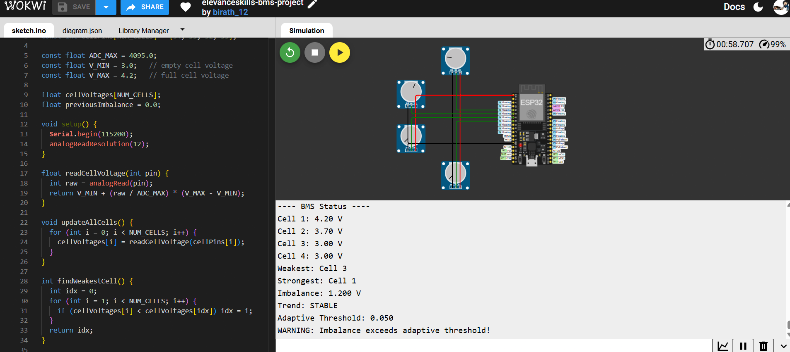

# Elevanceskills Internship — Project Report
**Modular Battery Management, Protection, and Telemetry System**

**Name:** Birath Kaur Ambhore  
**Internship:** Elevanceskills Embedded Systems Internship  
**Platform:** ESP32 (simulated in Wokwi)

---

## Table of Contents
1. [Task 1: Modular Battery Management Engine](#task-1-modular-battery-management-engine) — ✅ Completed
2. Task 2: Non-Blocking Protection Relay and Safety System — ✅ Completed
3. Task 3: Flicker-Free LCD Display Engine — 🚧 Pending
4. Task 4: Fault State Machine with Structured Recovery — 🚧 Pending
5. Task 5: Event-Driven Telemetry and Live Blynk Dashboard — 🚧 Pending
6. Task 6: Enterprise Blynk Analytics and Decision Dashboard — 🚧 Pending

---

## Task 1: Modular Battery Management Engine

### Objective
Design a modular BMS engine operating on a scalable array of battery cells,
where the number of cells is controlled by a single compile-time constant.
The engine identifies the weakest and strongest cells, calculates voltage
imbalance, tracks whether imbalance is increasing or decreasing, and applies
adaptive thresholds based on estimated State of Charge (SoC) rather than
fixed limits.

### Design Overview
- Cell count controlled via `#define NUM_CELLS 4`
- Cell voltages simulated using potentiometers wired to ESP32 ADC pins
  (GPIO34, 35, 32, 33), mapped from raw ADC readings (0–4095) to a
  realistic Li-ion voltage range (3.0V–4.2V)
- Core functions: `readCellVoltage()`, `updateAllCells()`,
  `findWeakestCell()`, `findStrongestCell()`, `calculateImbalance()`,
  `estimateSoC()`, `getAdaptiveThreshold()`
- Adaptive threshold logic: stricter thresholds at low SoC, relaxed
  thresholds at high SoC, reflecting that small imbalances matter more
  when a pack is nearly empty

### Verification
Tested in Wokwi by varying potentiometer positions to simulate charging/
discharging cells. Confirmed via Serial Monitor output that:
- Weakest/strongest cell identification updates correctly as voltages change
- Imbalance calculation matches expected voltage differences
- Trend correctly reports INCREASING, DECREASING, or STABLE between readings
- Adaptive threshold shifted from 0.030V to 0.050V as average SoC increased
- Warning correctly triggers whenever imbalance exceeds the current threshold

### Scalability Analysis (4 → 16 cells)
**Memory:** All cell data is stored in arrays sized by `NUM_CELLS`. Each
array element is a 4-byte float, so even at 16 cells, total memory usage
is under 100 bytes — negligible against the ESP32's 520KB RAM.

**Execution time:** Core analysis functions (`findWeakestCell`,
`findStrongestCell`, `calculateImbalance`) all iterate once through the
cell array — O(n) time complexity. At 16 cells, this remains a
microsecond-scale operation on a 240MHz processor, with no meaningful
performance impact.

**Data structures:** Because the design uses arrays indexed by a single
`NUM_CELLS` constant (rather than individually named variables per cell),
scaling from 4 to 16 cells requires only two changes: updating the
`NUM_CELLS` value and extending the `cellPins[]` array with the additional
ADC pins. No changes to core logic are needed — this directly fulfills
the "modular, reusable interface" requirement, and mirrors how real
production BMS ICs (e.g., TI BQ76952) handle configurable cell counts.

---

## Task 2: Non-Blocking Protection Relay and Safety System

### Objective
Develop a fully non-blocking safety system that protects the battery pack
by tripping a relay when dangerous conditions are detected, while avoiding
false trips from noise, and following a controlled, timed recovery process.

### Design Overview
- **Non-blocking timing:** Uses `millis()` throughout instead of `delay()`,
  so the relay state machine keeps running and checking conditions on
  every loop iteration without ever freezing the program.
- **Hysteresis:** Two separate thresholds prevent chattering — the relay
  trips when imbalance exceeds `0.15V`, but only resets once imbalance
  drops below `0.10V`. This gap prevents rapid on/off switching when
  imbalance hovers near a single value.
- **Debounce:** A detected fault must persist for at least `50ms`
  (`DEBOUNCE_MS`) before the relay actually trips, filtering out
  momentary electrical noise from being mistaken for a real fault.
- **Sensor anomaly detection:** Each cell's readings are checked every
  loop for:
  - *Frozen readings* — identical value repeated more than 5 times in a row
  - *Unrealistic jumps* — voltage change greater than 0.5V between two
    consecutive readings (physically impossible for a real cell)
  - *Out-of-range values* — voltage outside the valid 2.5V–4.3V window
- **Relay state machine:** Implemented with an enum
  (`NORMAL → FAULT_PENDING → TRIPPED → RECOVERING → NORMAL`), where every
  transition is logged with a clear before/after state description.
- **Timed recovery:** After a fault clears, the system does not
  immediately return to NORMAL. It enters a `RECOVERING` state and must
  observe 5 continuous seconds (`RECOVERY_MS`) of clean, in-threshold
  readings before fully resuming normal operation. Any fault recurrence
  during this window sends it back to `TRIPPED`.
- **Relay output:** Simulated using an LED wired to GPIO25 — LED ON
  represents the relay tripped (power cut), LED OFF represents normal
  operation.

### Verification
Tested in Wokwi by rapidly adjusting potentiometers to create imbalance
above the trip threshold. Confirmed via Serial Monitor that:
- The system correctly transitions through
  `NORMAL → FAULT_PENDING → TRIPPED` when imbalance persists past the
  debounce window
- The LED turns on exactly when the relay state reaches `TRIPPED`
- Reducing imbalance below the reset threshold moves the system into
  `RECOVERING`, and it only returns to `NORMAL` (LED off) after the full
  5-second timed recovery period with no repeated faults
- All state transitions are printed with clear before/after labels,
  satisfying the structured logging requirement
- The system remained stable under repeated, rapid fault triggering
  without missing transitions or requiring a reset

## Task 3: Flicker-Free LCD Display Engine
*Pending*

## Task 4: Fault State Machine with Structured Recovery
*Pending*

## Task 5: Event-Driven Telemetry and Live Blynk Dashboard
*Pending*

## Task 6: Enterprise Blynk Analytics and Decision Dashboard
*Pending*
